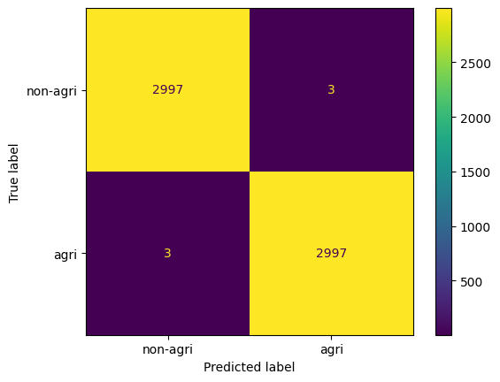

# Satellite Agricultural Land Classification with CNNs and CNN-ViT Models

[](https://github.com/ezedeem223/satellite-land-classification-cnn-vit/actions/workflows/ci.yml)

Independent deep learning project for satellite image classification focused on agricultural versus non-agricultural land. The repository consolidates an earlier experimentation workflow into a reproducible codebase with packaged model definitions, configuration files, CLI scripts, tests, CI, and curated historical outputs.

The current implementation is intentionally described exactly as it exists: a binary remote-sensing classification problem using the class folders `class_0_non_agri` and `class_1_agri`, implemented in both Keras and PyTorch, with CNN baselines and CNN-ViT hybrid models.

Maintained by Mohamad Sabbagh (`ezedeem223`) as a Python-first research and experimentation repository.



## Project Summary

- Binary satellite land classification for `agri` versus `non-agri`
- Framework coverage in both Keras and PyTorch
- Baseline CNN experiments plus CNN-ViT hybrid experiments
- Packaged Python source, runnable scripts, and explicit configs
- Historical evaluation artifacts preserved under `results/`
- Preserved experiment notebooks retained as supporting provenance material

## Why This Project Matters

Agricultural remote sensing often begins with practical land-use separation before expanding into richer land-cover taxonomies. This repository focuses on that narrower but meaningful setting and uses it to study data loading strategy, augmentation, framework behavior, convolutional feature extraction, and transformer-based global context modeling.

## Development Phases

| Phase | Focus | Preserved artifacts |
|---|---|---|
| Phase 1 | Dataset inspection, memory-aware loading, augmentation pipelines | Preserved loading and augmentation records |
| Phase 2 | CNN baselines in Keras and PyTorch | Baseline training records and framework comparison outputs |
| Phase 3 | CNN-backed transformer experiments | Keras and PyTorch CNN-ViT hybrid experiment records |
| Phase 4 | Final comparative evaluation | Preserved confusion matrices, ROC curves, reports, and comparison tables |

## Repository Highlights

- `src/satellite_land_classification/` provides the maintained package surface for configuration, data handling, training, evaluation, and prediction
- `scripts/` provides runnable entry points for preparation, training, evaluation, and prediction
- `configs/` keeps data and model settings explicit
- `results/` contains curated historical outputs and structured summaries
- `notebooks/` contains cleaned experiment notebooks for reference
- `source_notebooks/` preserves original notebook records for traceability

## Quick Start

Install the environment first:

```bash
python -m pip install --upgrade pip
python -m pip install -r requirements-dev.txt
python -m pip install -e .
```

Prepare the dataset locally. The repository does not bundle image data, so you need either:

- the download script:

```bash
python scripts/run_prepare_data.py --config configs/data.yaml
```

- or a manual placement of the extracted dataset at `data/images_dataSAT/`

Verify the local environment:

```bash
pytest
```

Then run a training script if you want fresh checkpoints, for example:

```bash
python scripts/run_train_pytorch_cnn.py --config configs/pytorch_cnn.yaml --data-config configs/data.yaml
```

Evaluation and prediction require local model weights in `models/`, either from your own training runs or from compatible external checkpoints referenced in the preserved experiment records.

## Installation

Runtime environment:

```bash
python -m pip install --upgrade pip
python -m pip install -r requirements.txt
python -m pip install -e .
```

Development environment:

```bash
python -m pip install --upgrade pip
python -m pip install -r requirements-dev.txt
python -m pip install -e .
```

If you prefer `make`, the repository includes:

- `make install-dev`
- `make prepare-data`
- `make test`
- `make train-keras-cnn`
- `make train-pytorch-cnn`
- `make train-keras-vit`
- `make train-pytorch-vit`
- `make evaluate`

## Python API

After installing the package and placing the dataset locally, the same configuration and validation utilities used by the CLI scripts are available directly from Python:

```python
from satellite_land_classification import load_config
from satellite_land_classification.data import validate_dataset_dir

config = load_config("configs/data.yaml")
dataset_dir = validate_dataset_dir(config["dataset"]["root_dir"])

print(dataset_dir)
```

## Dataset

The project uses the public `images-dataSAT.tar` archive referenced throughout the preserved experiment records. After extraction, the expected layout is:

```text
data/
`-- images_dataSAT/
    |-- class_0_non_agri/
    `-- class_1_agri/
```

Important details:

- `class_0_non_agri` and `class_1_agri` are the actual directory names used in the experiments and are kept unchanged
- the dataset is not tracked in git
- `scripts/run_prepare_data.py` downloads and extracts the archive to `data/images_dataSAT/`
- all training and evaluation commands assume the dataset exists locally unless you point configs elsewhere

More detail is in [data/README.md](data/README.md).

## Model Families

### CNN baselines

- Keras CNN
- PyTorch CNN

These serve as the baseline comparison between frameworks and establish the feature extractor later reused in the hybrid transformer experiments.

### CNN-ViT hybrids

The transformer stage in this repository is not a pure image-to-patch ViT pipeline. In both frameworks, the transformer operates on feature tokens produced by a CNN backbone. That hybrid design is a core technical characteristic of the project and is preserved explicitly in both the code and the documentation.

## Historical Results

The repository keeps two evidence tiers separate:

1. short training runs shown in the preserved experiment notebooks
2. later comparison/evaluation runs using pretrained checkpoints

That distinction matters. Some of the strongest scores in the preserved records come from evaluation notebooks that load pretrained weights rather than only the short local training snapshots.

### Preserved comparison metrics

| Model | Family | Framework | Accuracy | Precision | Recall | F1 | ROC-AUC |
|---|---|---:|---:|---:|---:|---:|---:|
| Keras CNN | CNN | Keras | 0.9925 | 1.0000 | 0.9850 | 0.9924 | 1.0000 |
| PyTorch CNN | CNN | PyTorch | 0.9988 | 0.9983 | 0.9993 | 0.9988 | 1.0000 |
| Keras CNN-ViT Hybrid | CNN-ViT | Keras | 0.9958 | 0.9990 | 0.9927 | 0.9958 | 0.9998 |
| PyTorch CNN-ViT Hybrid | CNN-ViT | PyTorch | 0.9990 | 0.9990 | 0.9990 | 0.9990 | 1.0000 |

Structured copies of these artifacts live in:

- [results/metrics.json](results/metrics.json)
- [results/model_comparison.csv](results/model_comparison.csv)
- [results/classification_report.txt](results/classification_report.txt)
- [results/preserved_notebook_outputs/](results/preserved_notebook_outputs/)

## Usage

Prepare data:

```bash
python scripts/run_prepare_data.py --config configs/data.yaml
```

Train the Keras CNN baseline:

```bash
python scripts/run_train_keras_cnn.py --config configs/keras_cnn.yaml --data-config configs/data.yaml
```

Train the PyTorch CNN baseline:

```bash
python scripts/run_train_pytorch_cnn.py --config configs/pytorch_cnn.yaml --data-config configs/data.yaml
```

Train the Keras CNN-ViT hybrid:

```bash
python scripts/run_train_keras_vit.py --config configs/keras_vit.yaml --data-config configs/data.yaml
```

Train the PyTorch CNN-ViT hybrid:

```bash
python scripts/run_train_pytorch_vit.py --config configs/pytorch_vit.yaml --data-config configs/data.yaml
```

Evaluate locally available checkpoints:

```bash
python scripts/run_evaluate.py --config configs/integration.yaml --data-config configs/data.yaml
```

Predict a single image:

```bash
python scripts/run_predict.py --model-type pytorch_vit --model-path models/pytorch_cnn_vit_best.pth --image-path path/to/image.jpg
```

## Experiment Archive

The repository keeps two notebook views:

- `notebooks/`
  Curated copies renamed for easier navigation
- `source_notebooks/`
  Preserved notebook records from earlier project iterations

Some preserved notebooks still contain environment-specific setup cells and period-specific narrative context because they are being retained as historical records rather than rewritten into new experiments.

## Project Structure

```text
satellite-land-classification-cnn-vit/
|-- .github/workflows/ci.yml
|-- configs/
|-- data/
|-- models/
|-- notebooks/
|-- results/
|-- scripts/
|-- source_notebooks/
|-- src/satellite_land_classification/
`-- tests/
```

## Limitations

- The dataset is not bundled with the repository.
- Model checkpoints are not bundled with the repository.
- Some preserved comparison scores come from externally referenced pretrained checkpoints.
- The transformer experiments are CNN-ViT hybrids, not pure standalone ViTs.
- The implemented task is binary agricultural versus non-agricultural classification, not a broader multi-class land-cover benchmark.

## Future Work

- Add checkpoint download helpers for the externally referenced evaluation weights
- Add experiment tracking for fresh reruns
- Extend the dataset/task scope to richer land-cover categories
- Add geospatial metadata-aware workflows and explainability overlays
- Add containerized training environments for heavier cross-framework reruns

## License

See [LICENSE](LICENSE). The maintained project code and documentation are released under MIT. Preserved notebook materials retain their original attribution and embedded notices.
