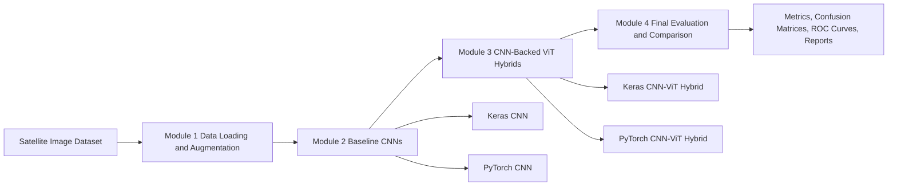

# Satellite Agricultural Land Classification Using CNNs and Vision Transformers

This repository refactors a multi-module AI capstone into a single reproducible project centered on satellite image classification for agricultural versus non-agricultural land. The broader course framing is geospatial land classification for agricultural applications, while the practical implementation preserved here is a binary remote-sensing workflow using the class folders `class_0_non_agri` and `class_1_agri`.

The original work progressed from data loading and augmentation, to Keras and PyTorch CNN classifiers, to CNN-backed Vision Transformer hybrids, and finally to framework-level evaluation of pretrained hybrid checkpoints. The notebooks remain preserved exactly in `source_notebooks/`, while the refactored package, scripts, configs, tests, and documentation make the project usable as a portfolio-grade GitHub repository.

## Why This Project Matters

Remote sensing workflows for agriculture depend on reliable land-use classification. Even a simplified binary agricultural versus non-agricultural setting is useful for building intuition around geospatial imagery, augmentation, framework differences, feature extraction, transformer integration, and evaluation discipline before moving to more complex land-cover maps.

## Key Features

- Preserves the full Module 1 to Module 4 capstone progression
- Keeps both Keras and PyTorch implementations instead of collapsing to one framework
- Keeps both baseline CNNs and CNN-ViT hybrid models
- Documents the real implementation honestly as binary agricultural versus non-agricultural land classification
- Extracts reusable code into `src/satellite_land_classification/`
- Adds config-driven scripts for data preparation, training, evaluation, and prediction
- Preserves notebook-derived historical metrics and plots under `results/`
- Includes tests, linting, CI, and repository documentation

## Architecture



## Quick Start

```bash
python -m pip install --upgrade pip
python -m pip install -r requirements-dev.txt
python -m pip install -e .
python scripts/run_prepare_data.py --config configs/data.yaml
pytest
```

## Installation

```bash
python -m pip install --upgrade pip
python -m pip install -r requirements.txt
python -m pip install -e .
```

For development tools:

```bash
python -m pip install -r requirements-dev.txt
python -m pip install -e .
```

## Dataset

The notebooks use the course archive `images-dataSAT.tar`, which extracts to `images_dataSAT/` with two folders:

- `class_0_non_agri`
- `class_1_agri`

In the refactored project the standardized location is `data/images_dataSAT/`. See [data/README.md](data/README.md) for the expected layout and the original archive URL.

## Methodology

### Module 1: Data Handling

- `Compare_Memory-Based_Versus_Generator-Based_Data_Loading.ipynb` inspects the dataset structure and contrasts direct image loading with more scalable generator-style handling.
- `Lab_M1L2_Data Loading_and_Augmentation_Using_Keras.ipynb` builds custom and built-in Keras loading pipelines.
- `Lab_M1L3_Data_Loading_and_Augmentation_Using_PyTorch.ipynb` builds custom `Dataset` and `ImageFolder`/`DataLoader` pipelines in PyTorch.

### Module 2: CNN Baselines

- `Lab_M2L1_Train_and_Evaluate_a_Keras-Based_Classifier.ipynb` trains a Keras CNN on the binary dataset.
- `Lab_M2L2_Implement_and_Test_a_PyTorch-Based_Classifier (2).ipynb` trains the parallel PyTorch CNN.
- `Lab_M2L3_Comparative_Analysis_of_Keras_and_PyTorch_Models (1).ipynb` evaluates downloaded pretrained CNN checkpoints and compares the two frameworks with classification metrics and ROC curves.

### Module 3: Vision Transformers

Despite the notebook titles, the practical implementations are not pure patch-from-image ViTs. Both frameworks build CNN-backed hybrid models in which a pretrained CNN acts as the feature extractor and a transformer operates on the resulting feature tokens.

- `Lab_M3L1_Vision_Transformers_in_Keras.ipynb` freezes a pretrained Keras CNN, extracts the `batch_normalization_5` feature map, and trains a Keras CNN-ViT hybrid.
- `Lab_M3L2_Vision_Transformers_in_PyTorch.ipynb` loads pretrained PyTorch CNN weights and trains a PyTorch CNN-ViT hybrid.

### Module 4: Integration and Final Evaluation

`lab_M4L1_Land_Classification_CNN-ViT_Integration_Evaluation.ipynb` evaluates pretrained Keras and PyTorch CNN-ViT hybrid checkpoints on the full dataset and compares them using accuracy, precision, recall, F1, ROC-AUC, confusion matrices, and ROC curves.

## Results

Two distinct evidence types appear in the notebooks, and they should not be conflated:

1. Short notebook training runs from Modules 2 and 3
2. Full comparison/evaluation notebooks that load pretrained checkpoints

### Short Training Snapshots From Notebook Runs

- Module 2 Keras CNN notebook: validation accuracy `0.5233` after the shown 3-epoch run
- Module 2 PyTorch CNN notebook: validation accuracy `0.9842` after the shown 3-epoch run
- Module 3 Keras CNN-ViT notebook: validation accuracy peaked at `0.9942` in epoch 2 of the shown 3-epoch run
- Module 3 PyTorch CNN-ViT notebook: validation accuracy reached `0.9925` in the shown 5-epoch run

These values are preserved in [results/metrics.json](results/metrics.json) under `training_snapshots`.

### Historical Comparison Metrics From Notebook Outputs

The table below comes from the comparison/evaluation notebooks, not from fresh reruns in this workspace:

| Model | Family | Framework | Accuracy | Precision | Recall | F1 | ROC-AUC |
|---|---|---:|---:|---:|---:|---:|---:|
| Keras CNN | CNN | Keras | 0.9925 | 1.0000 | 0.9850 | 0.9924 | 1.0000 |
| PyTorch CNN | CNN | PyTorch | 0.9988 | 0.9983 | 0.9993 | 0.9988 | 1.0000 |
| Keras CNN-ViT Hybrid | CNN-ViT | Keras | 0.9958 | 0.9990 | 0.9927 | 0.9958 | 0.9998 |
| PyTorch CNN-ViT Hybrid | CNN-ViT | PyTorch | 0.9990 | 0.9990 | 0.9990 | 0.9990 | 1.0000 |

Structured copies of these metrics live in:

- [results/metrics.json](results/metrics.json)
- [results/model_comparison.csv](results/model_comparison.csv)
- [results/classification_report.txt](results/classification_report.txt)

## Framework Comparison

Based on the preserved notebook evaluations:

- The PyTorch CNN slightly outperformed the Keras CNN in the Module 2 comparison notebook.
- The PyTorch CNN-ViT hybrid slightly outperformed the Keras CNN-ViT hybrid in the Module 4 evaluation notebook.
- Both frameworks achieved near-perfect ROC-AUC in the preserved evaluation outputs.

## CNN vs ViT / Integration Findings

The notebook record suggests that both CNN baselines and CNN-ViT hybrids perform strongly once pretrained checkpoints are used. The project does not support a claim that a pure transformer replaced CNNs outright, because the Vision Transformer stages in these notebooks are hybridized with CNN feature extraction. That hybrid setup is the real capstone logic and is preserved as such.

## Sample Outputs

Historical plots extracted from notebook outputs:

- [Keras CNN training accuracy](results/sample_visualizations/keras_cnn_training_accuracy.png)
- [PyTorch CNN training accuracy](results/sample_visualizations/pytorch_cnn_training_accuracy.png)
- [Keras CNN-ViT training accuracy](results/sample_visualizations/module3_keras_cnn_vit_accuracy.png)
- [PyTorch CNN-ViT training accuracy](results/sample_visualizations/module3_pytorch_cnn_vit_accuracy.png)
- [Keras CNN-ViT ROC curve](results/sample_visualizations/module4_keras_cnn_vit_roc.png)
- [PyTorch CNN-ViT ROC curve](results/sample_visualizations/module4_pytorch_cnn_vit_roc.png)
- [Final confusion matrix artifact](results/confusion_matrix.png)

## Usage

Prepare the dataset:

```bash
python scripts/run_prepare_data.py --config configs/data.yaml
```

Train the Keras CNN baseline:

```bash
python scripts/run_train_keras_cnn.py --config configs/keras_cnn.yaml --data-config configs/data.yaml
```

Train the PyTorch CNN baseline:

```bash
python scripts/run_train_pytorch_cnn.py --config configs/pytorch_cnn.yaml --data-config configs/data.yaml
```

Train the Keras CNN-ViT hybrid:

```bash
python scripts/run_train_keras_vit.py --config configs/keras_vit.yaml --data-config configs/data.yaml
```

Train the PyTorch CNN-ViT hybrid:

```bash
python scripts/run_train_pytorch_vit.py --config configs/pytorch_vit.yaml --data-config configs/data.yaml
```

Evaluate available checkpoints:

```bash
python scripts/run_evaluate.py --config configs/integration.yaml --data-config configs/data.yaml
```

Predict a single image:

```bash
python scripts/run_predict.py --model-type pytorch_vit --model-path models/pytorch_cnn_vit_best.pth --image-path path/to/image.jpg
```

## Notebooks

### Cleaned notebook index

- [notebooks/module1_memory_vs_generator_loading.ipynb](notebooks/module1_memory_vs_generator_loading.ipynb)
- [notebooks/module1_keras_data_loading.ipynb](notebooks/module1_keras_data_loading.ipynb)
- [notebooks/module1_pytorch_data_loading.ipynb](notebooks/module1_pytorch_data_loading.ipynb)
- [notebooks/module2_keras_cnn.ipynb](notebooks/module2_keras_cnn.ipynb)
- [notebooks/module2_pytorch_cnn.ipynb](notebooks/module2_pytorch_cnn.ipynb)
- [notebooks/module2_framework_comparison.ipynb](notebooks/module2_framework_comparison.ipynb)
- [notebooks/module3_keras_vit.ipynb](notebooks/module3_keras_vit.ipynb)
- [notebooks/module3_pytorch_vit.ipynb](notebooks/module3_pytorch_vit.ipynb)
- [notebooks/module4_cnn_vit_integration.ipynb](notebooks/module4_cnn_vit_integration.ipynb)
- [notebooks/exploration.ipynb](notebooks/exploration.ipynb)

### Original notebook archive

The exact uploaded files are preserved under [source_notebooks/](source_notebooks/README.md).

## Project Structure

```text
satellite-land-classification-cnn-vit/
├── .github/workflows/ci.yml
├── configs/
├── data/
├── models/
├── notebooks/
├── results/
├── scripts/
├── source_notebooks/
├── src/satellite_land_classification/
└── tests/
```

## Repository Layout Details

- `src/satellite_land_classification/`
  Refactored package code for data preparation, model definitions, evaluation, prediction, and plotting
- `scripts/`
  CLI entry points that call the package code with YAML configs
- `configs/`
  Data, model, and evaluation settings aligned with notebook defaults
- `results/`
  Historical notebook outputs and structured summaries
- `notebooks/`
  Stable, portfolio-friendly notebook filenames
- `source_notebooks/`
  Exact preserved originals

## Limitations

- The dataset is not committed to the repository.
- Model binaries referenced in the notebooks are not committed to the repository.
- Some of the strongest reported metrics come from downloaded pretrained checkpoints used in later notebooks, not from the short training runs alone.
- Module 3 is a CNN-ViT hybrid workflow, not a pure image-to-patch ViT pipeline.
- The current implementation is binary agricultural versus non-agricultural classification, not a broader multi-class land-cover map.

## Future Work

- Add automated download helpers for the notebook-referenced pretrained checkpoints
- Add reproducible experiment tracking for fresh reruns
- Extend the project from binary classification to richer land-cover taxonomies
- Add geospatial metadata handling, coordinate-aware sampling, and explainability overlays
- Add Docker or Conda environment support for heavier cross-framework training runs

## License

See [LICENSE](LICENSE). The refactored code and documentation are released under MIT, while preserved source notebook materials retain their embedded notices and attribution.

